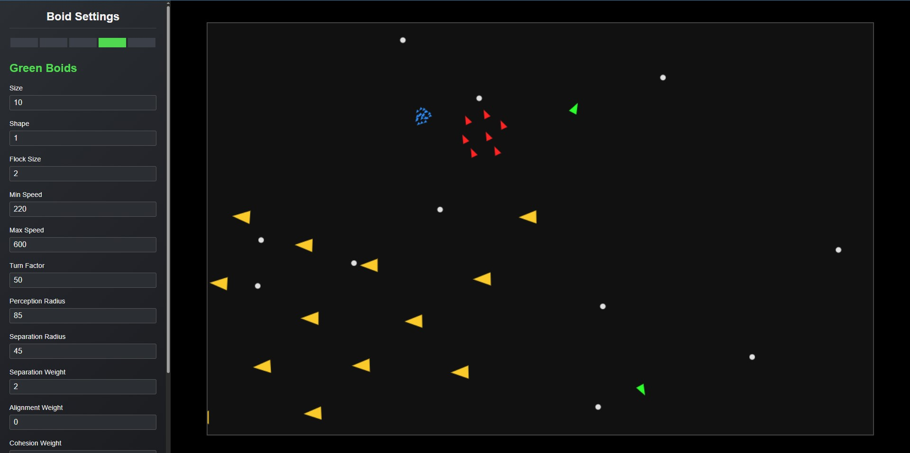

# Boids

A simulation of the flocking behaviour of birds, developed by Craig Reynolds in 1986.

At the base level, boids follow just 3 simple rules.

> __Separation:__ boids move away from nearby flockmates
>
> __Alignment:__ boids try to match the average direction of nearby flockmates
>
> __Cohesion:__ boids fly towards the _center of mass_ of nearby flockmates

From these principles, the flock as a whole exhibits unique and complex behaviour that was not programmed into individual boids. 
This is known as [emergent behaviour](https://en.wikipedia.org/wiki/Emergence).

You can learn more about the implementation of these rules from 
[Cornell](https://people.ece.cornell.edu/land/courses/ece4760/labs/s2021/Boids/Boids.html#Algorithm-Overview).

## Description

There are 5 different flock types in this simulation, 
each have their own unique properties:

- __Red Boids__
	- Standard flock
	- Average in everything
	- Moderate speed, separation, alignment and cohesion weights
	- Stay somewhat close to anchor

- __Yellow Boids__
	- Big boids
	- Move slowly and gracefully
	- See very far, and like to align together
	- Experience no cohesive force
	- Separate slowly, but enjoy a lot of personal space
	- Defense formation when anchored

- __Blue Boids__
	- Very tiny boids
	- Move slightly faster
	- Stay close together
	- Experience no alignment
	- Stay very close to anchor, and tighten their cohesion when anchored

- __Green Boids__
	- Love boids
	- Only two exist
	- Super fast
	- Good at avoiding obstacles
	- Do not align with each other, they are bound by cohesion alone

- __White Boids__
	- Dumb boids
	- Slow
	- Poor eyesight
	- Lacking cohesion, they tend to break apart from their flock
	- They bump into each other, pushing one another forwards
	- Do not herd to the anchor very well

## Features

The user may change various parameters for each of the 5 flocks as they move.

The tab that is currently selected in the settings panel will be known as the _active flock_.

- __Solo mode__ – focus only on the active flock. Other flocks will not be drawn or updated.

- __Collisions__ (off by default) – boids will steer away from boids belonging to different flocks.

- __Anchor attraction__ – boids seek a fixed point on screen and flock around it.

Additionally, boids will turn around when approaching the edge of the screen.

## Settings

- __Size__

- __Shape__ 
	- Circlular or triangular
	
- __Flock Size__
	- Number of boids

- __Min Speed__
	- Implicitly capped at maximum speed

- __Max Speed__

- __Turn Factor__
	- How strong the force of repulsion at edges

- __Perception Radius__
	- How far boids can see for alignment and cohesion

- __Separation Radius__
	- How close other boids can be before separating
	- The radius also contributes to the magnitude of separation vector
	- Same radius is used for collisions with other flocks

- __Weights__
	- Scale the separation, alignment, and cohesion vectors by this factor

- __Anchor Radius__
	- Stop attracting boids to the anchor once they are within this radius

- __Anchored Cohesion__
	- When boids are anchored, they experience no alignment and a modified cohesion weight

## Controls

Key | Action
:----:|:-------:
`Spacebar` 		| Pause the simulation
`R` 			| Scatter active boids
`T`				| Toggle solo mode
`D`				| Toggle collisions
`1`				| Activate flock 1 – __Red boids__
`2`				| Activate flock 2 – __Yellow boids__
`3`				| Activate flock 3 – __Blue boids__
`4`				| Activate flock 4 – __Green boids__
`5`				| Activate flock 5 – __White boids__
`Left-click` 	| Add an anchor point to canvas
`Double-click`	| Attach or remove an anchor point to the cursor
`Escape`		| Deselect input / remove anchor point

 

- Clicking and dragging will continuously move the anchor point.

- To remove an anchor, press `Escape` or click outside the canvas area.

- Anchors cannot move outside the canvas area. Dragging them off the screen will remove them.